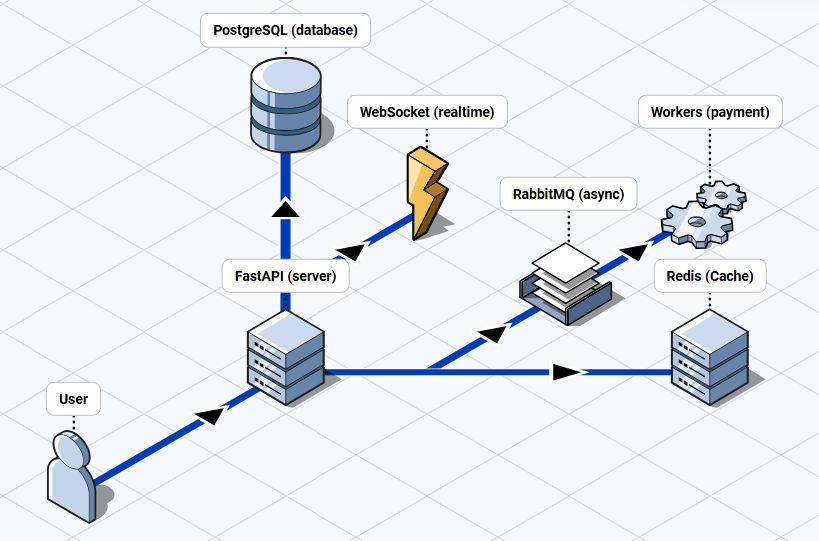

A scalable e-commerce backend built with **FastAPI**, featuring authentication, role-based access control, async processing with RabbitMQ, and real-time order tracking via WebSockets.

## Features

- **Authentication**: JWT with refresh tokens, password hashing (Argon2), rate limiting
- **Authorization**: Role-based access (USER, ADMIN, DRIVER)
- **Products & Categories**: Full CRUD with pagination, filters, and search
- **Shopping Cart**: Stock validation, quantity management
- **Orders**: State machine transitions, shipping addresses, driver assignment
- **Real-time Tracking**: WebSocket-based order tracking with driver location updates
- **Async Processing**: RabbitMQ for payment processing with retry and dead-letter queues
- **Infrastructure**: Health checks, CORS, Redis caching for rate limits

## Architecture



## Quick Start

### Prerequisites

- Python 3.11+
- Docker & Docker Compose
- Make

### 1. Clone and Setup

```bash
git clone https://github.com/jeremyjsx/orderly.git
cd orderly

# Create virtual environment
make venv

# Install dependencies
make install

# Setup environment
cp .env.example .env
```

### 2. Start Services

```bash
# Start PostgreSQL, Redis, RabbitMQ
docker-compose up -d

# Apply database migrations
alembic upgrade head

# Start the API server
make run
```

### 3. Access the API

- **Swagger UI**: http://localhost:8000/docs
- **ReDoc**: http://localhost:8000/redoc
- **RabbitMQ Management**: http://localhost:15672 (orderly/orderly)

## Testing

```bash
# Run all tests
make test

# Lint code
make lint

# Format code
make format
```

## Project Structure

```
app/
├── api/                    # API router aggregation
├── core/                   # Config, security, redis, middleware
│   ├── config.py           # Pydantic settings
│   ├── security.py         # JWT, password hashing
│   ├── redis.py            # Redis client + refresh tokens
│   ├── rate_limit.py       # Sliding window rate limiter
│   └── middleware.py       # Rate limit middleware
├── db/                     # Database session
├── events/                 # Async processing
│   ├── client.py           # RabbitMQ connection
│   ├── orders/             # Order events + WebSocket
│   └── payments/           # Payment worker
├── modules/
│   ├── auth/               # Login, register, refresh
│   ├── cart/               # Shopping cart
│   ├── categories/         # Product categories
│   ├── health/             # Health checks
│   ├── orders/             # Orders + shipping
│   ├── products/           # Product catalog
│   └── users/              # User management
└── main.py                 # App entry point
```

## Tech Stack

| Category | Technology |
|----------|------------|
| Framework | FastAPI |
| Database | PostgreSQL + SQLAlchemy (async) |
| Cache | Redis |
| Message Queue | RabbitMQ |
| Auth | JWT + Argon2 |
| Real-time | WebSockets |
| Migrations | Alembic |
| Testing | pytest + httpx |


## Environment Variables

See `.env.example` for all available configuration options.

Key variables:
- `DATABASE_URL`: PostgreSQL connection string
- `REDIS_URL`: Redis connection string
- `RABBITMQ_URL`: RabbitMQ connection string
- `JWT_SECRET_KEY`: Secret for JWT signing (change in production!)
- `CORS_ORIGINS`: Allowed origins (comma-separated or `*`)

